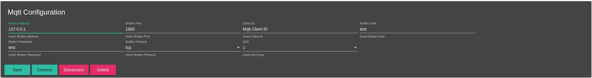
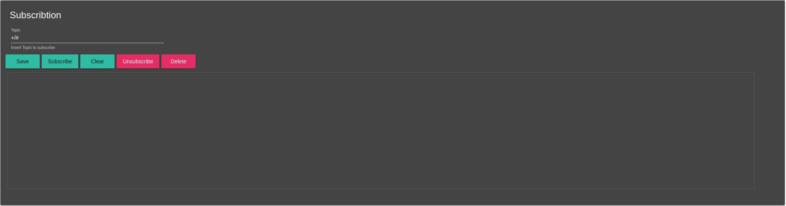
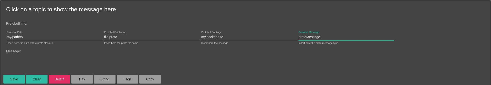
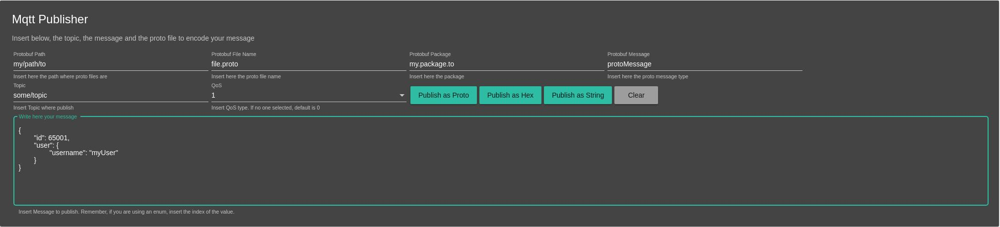

[](https://angular.io/) [](https://electron.atom.io/)

# MQTT Cripto


# Getting Started

Clone this repository locally :

``` bash
git clone https://github.com/${user}/mqtt-cripto.git
```

Install dependencies with npm :

``` bash
npm install
```
Run the application :

``` bash
npm start
```

Build the application :

- Linux 
``` bash
npm run electron:linux
```

- Windows
``` bash 
npm run electron:windows
```

- Mac
``` bash
npm run electron:mac
```


# How to

You can use Mqtt Cripto to subscribe or publish on your MQTT broker.

<hr>

## Download

### Linux

http://www.mediafire.com/file/kzpzioguu4hbn4q/Mqtt_Cripto_Linux_Version

### Windows

http://www.mediafire.com/file/romfb61s3pe10g6/Mqtt_Cripto_Windows_Version.exe/file

<hr>


## Broker Configuration



- Insert your broker configuration and click on 'Connect'.
- Click on 'Disconnect' to disconnect from the broker.
- You can also 'Save' and 'Delete' the current configuration using buttons.



- Insert the topic where you want to subscribe to and click on 'Subscribe'.
- You can save your topic by clicking on the 'Save' button.
- When you are subscribed and you wanna clear the message buffer click on 'Clear'.
- As below, you can 'Unsubscribe' and 'Delete' your topic.
- Click a topic into the list to show more information.



- Clicking on a topic in the section below, the message info will be shown.
- Insert into the input boxes your protobuf information. The application needs to know the path of the root file, the name file, the package and the message name.
- If you click on 'Save' all the protobuf information will be saved.
- If you click on 'Clear' the focussed message will be removed.
- If you click on 'Delete' all the protobuff information will be removed.
- If you click on 'Hex' the message will be converted into hex format (default).
- If you click on 'String' the message will be converted into string format.
- If you click on 'JSON' and you have inserted protobuf information, the message will be converted in JSON.
- If you click on 'Copy' the message will be copied to the clipboard.



- Insert into the input boxes your protobuf information. The application needs to know the path of the root file, the name file, the package and the message name.
- Write the message ( you can write the message as String, Hex or Json ).
- You can publish the message on the broker in string, hex or protobuf format.
- You can clear all the content of the text area by clicking on 'Clear'.

